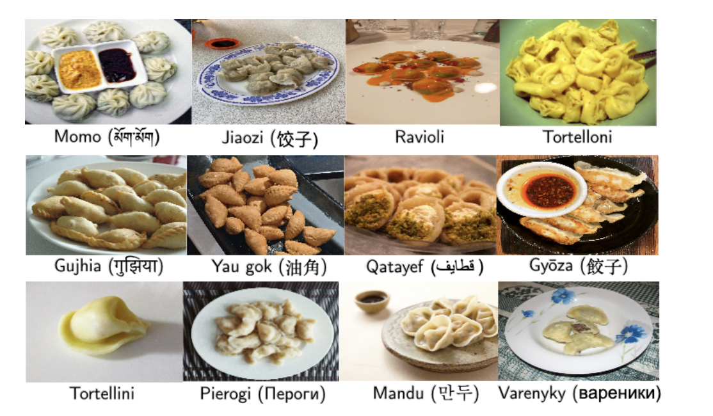
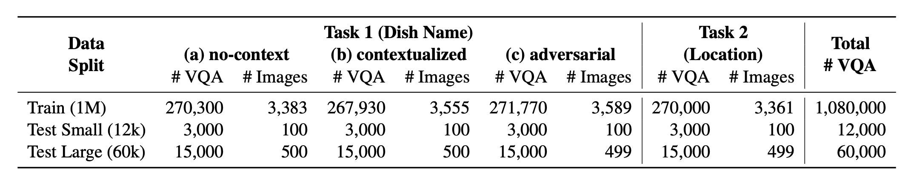
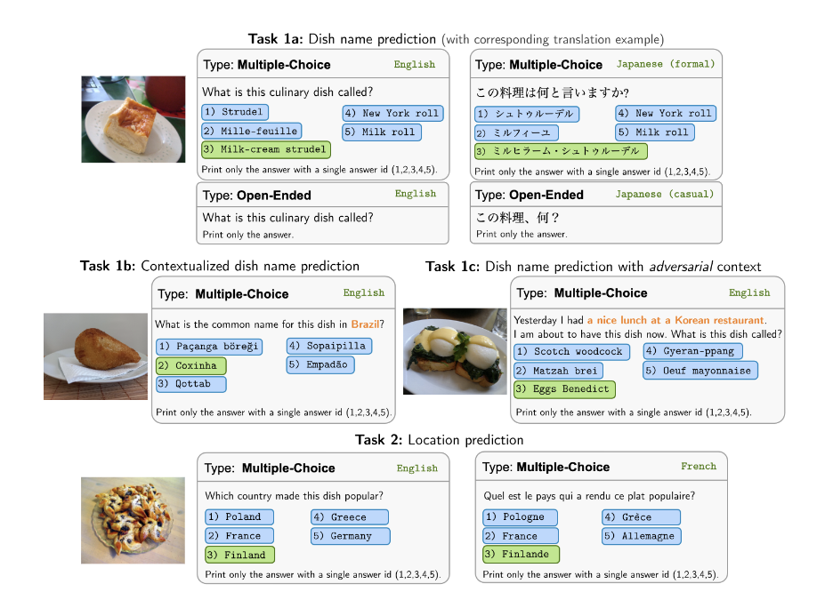
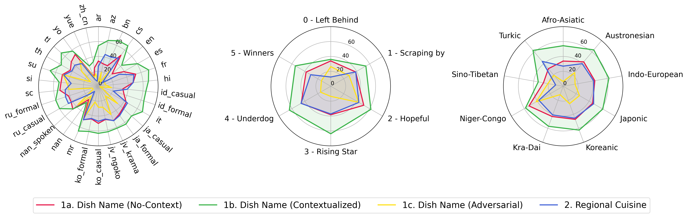
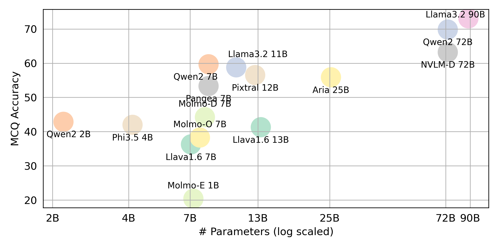
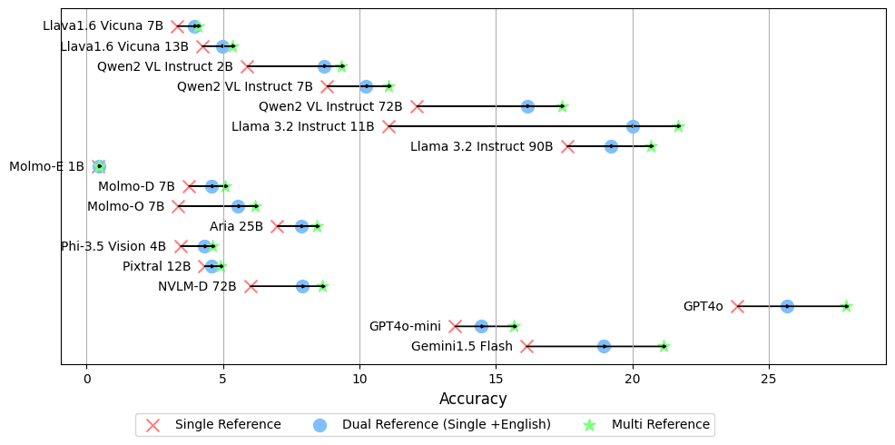
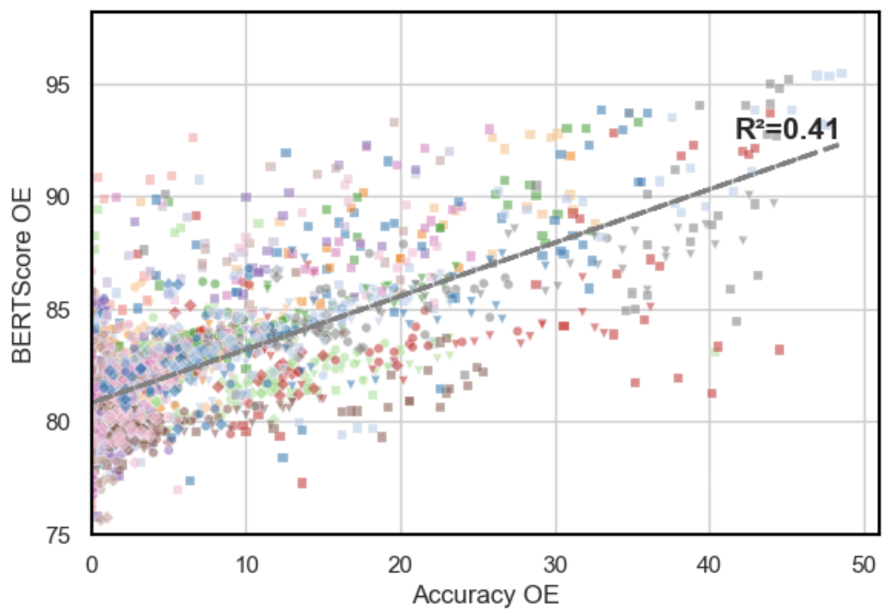

# 🥘 WorldCuisines: Multilingual Multicultural VQA Benchmark

[](https://creativecommons.org/licenses/by-sa/4.0/)



Introducing **WorldCuisines 🥘**, a massive-scale multilingual and multicultural VQA benchmark that challenges Vision-Language Models (VLMs) to understand cultural food diversity in over **30 languages and dialects**, across **9 language families**, with over **1 million data points** available.

### Key Stats:
- **Over 1 Million** text-image pairs
- Coverage of **2.4k** dishes with **6k** images.
- Coverage of **30 languages** across **9 language families**


## Table of Contents

- [🥘 WorldCuisines: Multilingual Multicultural VQA Benchmark](#-worldcuisines-multilingual-multicultural-vqa-benchmark)
    - [Key Stats:](#key-stats)
  - [Table of Contents](#table-of-contents)
  - [📜 Paper](#-paper)
  - [📊 Benchmark](#-benchmark)
  - [⚡ Environment Setup](#-environment-setup)
    - [Via `pip`](#via-pip)
    - [Via `conda`](#via-conda)
  - [❓ VQA Dataset Generation](#-vqa-dataset-generation)
  - [Main Arguments](#main-arguments)
  - [Additional Arguments](#additional-arguments)
  - [💯 Experiment Result](#-experiment-result)
  - [🧪 Running Experiments](#-running-experiments)
    - [Main Arguments](#main-arguments-1)
    - [Models Handle](#models-handle)
  - [📈 Aggregating Experiment Result](#-aggregating-experiment-result)
  - [🏞️ Visualizing the Scores](#️-visualizing-the-scores)
    - [Examples of Radar Plot](#examples-of-radar-plot)
    - [Examples of Other Plots](#examples-of-other-plots)
  - [💻 Models Support](#-models-support)
    - [Generative VLMs:](#generative-vlms)
      - [Open-Source](#open-source)
      - [Proprietary](#proprietary)
  - [🚀 How to Contribute?](#-how-to-contribute)
  - [✏️ On Progress](#️-on-progress)

## 📜 Paper 
This is the source code of the paper [[Arxiv]](https://arxiv.org/abs/2410.12705):

This code has been written using Python. If you use any code or datasets from this toolkit in your research, please cite the associated paper.
<pre>
Pending Google Scholar Indexing
</pre>

## 📊 Benchmark

WorldCuisines 🥘 comprises a balanced proportion of its **2 supported tasks**. We provide over **1M training data** and a **60k evaluation data**.



Our benchmark evaluates VLMs on two tasks: dish name prediction and dish location prediction. The settings include **no-context**, **contextualized**, and **adversarial** infused prompt as the model's input.



## ⚡ Environment Setup

### Via `pip`
```
pip install -r requirements.txt
```
### Via `conda`
```
conda env create -f env.yml
```

## ❓ VQA Dataset Generation
To generate a VQA dataset from the knowledge base, you can refer to the `generate_vqa/sampling.py` script. This script generates the dataset for various tasks in both training and testing sets.

Example Commands:
To generate datasets for **Test Small**, **Test Large**, and **Train** sets, run the following commands:

```bash
cd generate_vqa
mkdir -p generated_data

# Test Small Task 1
python3 sampling.py -o "generated_data/test_small_task1.csv" -n 9000 -nd 100 -np1a 1 -np1b 0 -np1c 1 -npb 1 --is-eval

# Test Small Task 2
python3 sampling.py -o "generated_data/test_small_task2.csv" -n 3000 -nd 100 -np1a 0 -np1b 1 -np1c 0 -npb 0 --is-eval

# Test Large Task 1
python3 sampling.py -o "generated_data/test_large_task1.csv" -n 45000 -nd 500 -np1a 1 -np1b 0 -np1c 1 -npb 1 --is-eval

# Test Large Task 2
python3 sampling.py -o "generated_data/test_large_task2.csv" -n 15000 -nd 500 -np1a 0 -np1b 1 -np1c 0 -npb 0 --i-eval

# Train Task 1
python3 sampling.py -o "generated_data/train_task1.csv" -n 810000 -nd 1800 -np1a 5 -np1b 0 -np1c 5 -npb 5 --no-is-eval

# Train Task 2
python3 sampling.py -o "generated_data/train_task2.csv" -n 270000 -nd 1800 -np1a 0 -np1b 5 -np1c 0 -npb 0 --no-is-eval
```

## Main Arguments

| Argument                             | Description                                                                                                       | Example                                 |
|--------------------------------------|-------------------------------------------------------------------------------------------------------------------|-----------------------------------------|
| `-o`, `--output-csv`                | Output CSV path where the generated VQA dataset will be saved.                                                    | `generated_data/test_small_task1.csv`  |
| `-n`, `--num-samples`               | Maximum number of instances to be generated. If more samples are requested than possible, the script will adjust. | `9000`                                  |
| `-nd`, `--n-dish-max`               | Maximum unique number of dishes to sample from.                                                                   | `100`                                   |
| `-np1a`, `--n-prompt-max-type1a`     | Maximum unique prompts from Task 1(a) (no-context) to sample per dish in each iteration.                        | `1`                                     |
| `-np1b`, `--n-prompt-max-type1b`     | Maximum unique prompts from Task 1(b) (contextualized) to sample per dish in each iteration.                    | `1`                                     |
| `-np1c`, `--n-prompt-max-type1c`     | Maximum unique prompts from Task 1(c) (adversarial) to sample per dish in each iteration.                        | `1`                                     |
| `-np2`, `--n-prompt-max-type2`      | Maximum unique prompts from Task 2 to sample per dish in each iteration.                                        | `1`                                     |
| `--is-eval`, `--no-is-eval`          | Whether to generate evaluation (test) or training datasets.                                                    | `--is-eval` for test, `--no-is-eval` for train |

## Additional Arguments

| Argument                             | Description                                                                                                       | Example                                         |
|--------------------------------------|-------------------------------------------------------------------------------------------------------------------|-------------------------------------------------------|
| `-fr`, `--food-raw-path`            | Path to the raw food data CSV.                                                                                   | `food_raw_6oct.csv`                                  |
| `-fc`, `--food-cleaned-path`        | Path to the cleaned food data CSV.                                                                                | `food_cleaned.csv`                                   |
| `-q`, `--query-context-path`        | Path to the query context CSV.                                                                                    | `query_ctx.csv`                                      |
| `-l`, `--loc-cuis-path`             | Path to the location and cuisine CSV.                                                                             | `location_and_cuisine.csv`                            |
| `-ll`, `--list-of-languages`        | Specify languages to be used as a list of strings.                                                               | `'[\"en\", \"id_formal\"]'`                                                  |
| `-aw`, `--alias-aware`               | Enable adversarial answers with parallel aliases instead of replacing dishes without translation with English    | `--alias-aware` for the requirement to find answers that contain parallel translation across all languages, `--no-alias-aware` for relaxing the parallel dishes name requirement                                                  |

## 💯 Experiment Result
If you wish to get the final result for all VLLMs that we evaluate, please refer to this [leaderboard](https://huggingface.co/spaces/worldcuisines/worldcuisines) for the summary. The raw results are placed in the `evaluation/score/json` directory.

## 🧪 Running Experiments
All experiment results will be stored in the `evaluation/result/` directory. You can execute each experiment using the following commands:

```
cd evaluation/
python run.py --model_path {model_path} --task {task} --type {type} 
```
### Main Arguments
| Argument         | Description                                       | Example / Default                     |
|------------------|---------------------------------------------------|---------------------------------------|
| `--task`         | Task number to evaluate (1 or 2)                  | `1` (default), `2`                    |
| `--type`         | Type of question to evaluate (`oe` or `mc`)       | `mc` (default), `oe`                  |
| `--model_path`   | Path to the model                                 | `Qwen/Qwen2-VL-72B-Instruct` (default) + [others](#models) |
| `--fp32`         | Use `float32` instead of `float16`/`bfloat16`                    | `False` (default)                     |
| `--multi_gpu`    | Use multiple GPUs                                 | `False` (default)                     |
| `-n`, `--chunk_num` | Number of chunks to split the data into          | `1` (default)                         |
| `-k`, `--chunk_id`  | Chunk ID (0-based)                              | `0` (default)                         |
| `-s`, `--st_idx` | Start index for slicing data (inclusive)          | `None` (default)                      |
| `-e`, `--ed_idx` | End index for slicing data (exclusive)            | `None` (default)                      |

### Models Handle
- `rhymes-ai/Aria`
- `meta-llama/Llama-3.2-11B-Vision-Instruct`
- `meta-llama/Llama-3.2-90B-Vision-Instruct`
- `llava-hf/llava-v1.6-vicuna-7b-hf`
- `llava-hf/llava-v1.6-vicuna-13b-hf`
- `allenai/MolmoE-1B-0924`
- `allenai/Molmo-7B-D-0924`
- `allenai/Molmo-7B-O-0924`
- `microsoft/Phi-3.5-vision-instruct`
- `Qwen/Qwen2-VL-2B-Instruct`
- `Qwen/Qwen2-VL-7B-Instruct`
- `Qwen/Qwen2-VL-72B-Instruct`
- `mistralai/Pixtral-12B-2409`
- ***TODO: Proprietary Models***


## 📈 Aggregating Experiment Result 
Edit `evaluation/score/score.yml` to determine scoring mode, evaluation set, and evaluated VLMs. Note that `mc` means multiple-choice and `oe` means open-ended.

```yml
mode: all # {all, mc, oe}  all = mc + oe
oe_mode: multi # {single, dual, multi}
subset: large # {large, small}
models:
- llava-1.6-7b
- llava-1.6-13b
- qwen-vl-2b
- qwen2-vl-7b-instruct
- qwen2-vl-72b
- llama-3.2-11b
- llama-3.2-90b
- molmoe-1b
- molmo-7b-d
- molmo-7b-o
- aria-25B-moe-4B
- Phi-3.5-vision-instruct
- pixtral-12b
- nvlm
- gpt-4o-2024-08-06
- gpt-4o-mini-2024-07-18
- gemini-1.5-flash
```

In addition to the `multi` mode for generating the `oe` score, which compares the answer to the golden labels across all languages, we also support other golden label referencing settings:

- **`single` reference**: compares the answer only to the golden label in the original language.
- **`dual` reference**: compares the answer to the golden label in the original language and English.

Once set, run this command:
```bash
cd evaluation/score/
python score.py
```


## 🏞️ Visualizing the Scores

We provide radar, scatter, and connected scatter-line plots to visualize scoring results for all VLMs in `evaluation/score/plot/`.

To generate all **radar plot**, use:
```
python evaluation/score/plot/visualization.py
```

### Examples of Radar Plot


You can also modify `evaluation/score/score.yml` to select which VLMs to visualize and adjust plot labels in `plot_mapper.yml`.

### Examples of Other Plots

  


Other plot generation scripts are available in the `*.ipynb` files within the same directory.

## 💻 Models Support
Our codebase supports the usage of multiple models for the experiments, providing flexibility for customization of the list shown below:

### Generative VLMs:
#### Open-Source
- Llava1.6 Vicuna [llava-hf/llava-v1.6-vicuna-7b-hf](https://huggingface.co/llava-hf/llava-v1.6-vicuna-7b-hf) [llava-hf/llava-v1.6-vicuna-13b-hf](https://huggingface.co/llava-hf/llava-v1.6-vicuna-13b-hf)
- Qwen2 VL Instruct [Qwen/Qwen2-VL-2B-Instruct](https://huggingface.co/Qwen/Qwen2-VL-2B-Instruct) [Qwen/Qwen2-VL-7B-Instruct](https://huggingface.co/Qwen/Qwen2-VL-7B-Instruct) [Qwen/Qwen2-VL-72B-Instruct](https://huggingface.co/Qwen/Qwen2-VL-72B-Instruct)
- Llama 3.2 Instruct [meta-llama/Llama-3.2-11B-Vision-Instruct](https://huggingface.co/meta-llama/Llama-3.2-11B-Vision-Instruct) [meta-llama/Llama-3.2-90B-Vision-Instruct](https://huggingface.co/meta-llama/Llama-3.2-90B-Vision-Instruct)
- Molmo-E 1B [allenai/MolmoE-1B-0924](https://huggingface.co/allenai/MolmoE-1B-0924)
- Molmo-D 7B [allenai/Molmo-7B-D-0924](https://huggingface.co/allenai/Molmo-7B-D-0924)
- Molmo-O 7B [allenai/Molmo-7B-O-0924](https://huggingface.co/allenai/Molmo-7B-O-0924)
- Aria 25B  [rhymes-ai/Aria](https://huggingface.co/rhymes-ai/Aria)
- Phi-3.5 Vision 4B [microsoft/Phi-3.5-vision-instruct](https://huggingface.co/microsoft/Phi-3.5-vision-instruct)
- Pixtral 12B [mistralai/Pixtral-12B-2409](https://huggingface.co/mistralai/Pixtral-12B-2409)

#### Proprietary 
(last tested as of October 2024)
- GPT-4o
- GPT-4o Mini
- Gemini 1.5 Flash

## 🚀 How to Contribute?
Feel free to create [an issue](https://github.com/worldcuisines/worldcuisines/issues) if you have any questions. And, create [a PR](https://github.com/worldcuisines/worldcuisines/pulls) for fixing bugs or adding improvements.

If you are interested to create an extension of this work, feel free to reach out to [us](mailto:gentaindrawinata@gmail.com)!

Support our open source effort ⭐

## ✏️ On Progress
We are improving the code, especially on inference part to generate `evaluation/result` and scoring visualization code unification, to make it more user-friendly and customizable.
